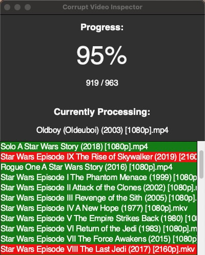

# Corrupt Video Inspector

  

### About
Sometimes you come across a video file that is corrupt. Whent trying to play the file in a desktop video player, it is not able to be viewed at all. Other times, it is not as black and white as a video file being "playable" or "non-playable". Sometimes videos have buggy/fuzzy/freezy-glitchy sections within several timestamps of the video. For example, the first hour of the video will run smoothly, but then every few minutes there will be a 20 second chunk of freezy-glitchiness, only to resume normally once that bad sector has passed. So it may be still watchable, but annoying and detracts from the overall enjoyment of the movie. If you are a movie collector like me, you have thousands of files and a small fraction of them may be lightly-corrupt. The goal was to identify which files in my collection were corrupt. This program is made for the sophisticated schemer. 

### Functionality
This program searches though a selected directory and its subdirectories for all video file types. The file types are analyzed under the hood using `ffmpeg`. If any bad sectors in the video file are found, it will be marked as corrupt. If not, it is deemed a healthy file. This performs a very thorough scan of each file and is the best way to most accurately assess the integrity of the video files. The program is written in Python and has a GUI interface built with `tkinter`. This program was built with macOS and Apple-silicone in mind. `py2app` was used to create a standalone application that runs on macOS without further configuration. 

*Update: A Windows executable has now been created using `pyinstaller`*

### How to Use
* If using macOS, simply download and run the `dist/CorruptVideoInspector.app` file
* If using Windows, download and run the [CorruptVideoInspector.exe](https://drive.google.com/file/d/107tgKjAzLsNOTk_kd7SAWRF79h_zl0Nn/view?usp=share_link) compiled executable. (The above file is hosted on Google Drive because GitHub does not allow files of more than 25MB to be uploaded here)
* If using Linux, simply run the python script `CorruptVideoInspector.py` (note: you first may need to downlaod the appropriate `ffmpeg` binary for your operating system, since the one hosted here is for macOS only)
* Chose a directory (this will search the selected directory and all containing subdirectories for all video files)
* Choose an index to start the scan at **(leave '1' for default to start from the beginning and scan all files)**. This "index" option allows you resume scanning from a certain video. For example, if your computer accidently restarted after scanning 90 of 100 videos in a directory, you can restart the program and type "90" to start from the 90th video file instead of scanning all videos over from the beginning. If you are unsure which video was being scanned when the computer restarted, check the "_Results.csv" file for an indexed listing of all files that have successfully been scanned/completed. 
* The scan will automatically start once an index is chosen. You will be prompted with a window showing the total completed progress (0-100%), the file that is currently being scanned, and a list of all previously scanned videos which are marked with a green/red highlight, indicating healthy/corrupt. In addition to the GUI, two files are automatically created upon running the application: _Logs.txt and _Results.csv. These files are created and stored in the directory that was first chosen to scan for video files. These files will be overwritten on each run of the program. So remember to move them to another directory to store long-term once a full directory scan has been completed. _Logs.txt simply shows a text-based record of each file scanned, if it is healthy/corrupt, and any exceptions encountered during the scan. _Results.csv shows two colummns: "Video File" and "Corrupt". The "Corrupt" column will have a "1" if the file is corrupt. Otherwise, a "0" indicates the file is healthy. 

  

### Technical references
* [FFMPEG official documentation](https://ffmpeg.org/ffmpeg.html)
* [The command to scan a video file for integrity](https://gist.github.com/ridvanaltun/8880ab207e5edc92a58608d466095dec)
* [More details on checking integrity of video files](https://superuser.com/questions/100288/how-can-i-check-the-integrity-of-a-video-file-avi-mpeg-mp4)
* [tkinter](https://docs.python.org/3/library/tkinter.html)
* [py2app](https://py2app.readthedocs.io/en/latest/#)
* [pyinstaller](https://pyinstaller.org/en/stable/)

### Caveats
* Since this utilizes an extremely thorough scan technique, the process is very slow. A 2GB movie may take about 2-5 minutes to scan. A 50GB movie may take 10-20 minutes to scan. If your collection is big, the scanning process can take days. This is all dependent on your hardware, of course. But since `ffmpeg` utilizes an in-depth scan, every sector of the video is scanned, so there are no false positives/negatives. Other scanning techniques may scan the video quickly, but in reality only the metadata is scanned, not the file itself. There are also other scanning techniques that will scan the first 5% of the video and if no error is found, it will be marked healthy. But this is not accurate either because the video may have unhealthy sections within the last 10% of the movie. Therefore, this technique is the most accurate, forfeiting speed for precision. 
* `ffmpeg` will fully utilize the computer's CPU (80-100%)

*For tkinter to work on Mac M1, must use python 3.10.5 or greater
